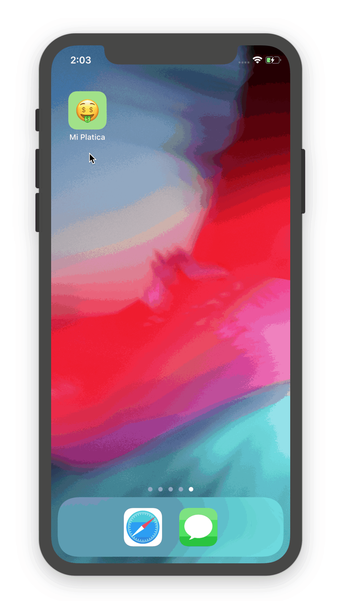

# App `🤑 Mi Platica`



Simple app which uses great Fintual API: https://fintual.cl/api-docs.

App show Portfolio with mutual funds.

Right now portfolio data is hardcoded.
See `PortfolioStorage.swift:25`

```swift
func load() -> Portfolio? {
    
    let portfolio = Portfolio()
    portfolio.assetShares = [
        AssetShares(realAssetId: "2072", shares: 1655.6884),
        AssetShares(realAssetId: "282", shares: 205.4709),
        AssetShares(realAssetId: "3285", shares: 418.8769),
    ]
    
    return portfolio
}
```

`2072`, `282` and `3285` are real assets:  
- **FONDO MUTUO INVERSIÓN BRASIL - Serie A** https://fintual.cl/api/real_assets/2017  
- **FONDO MUTUO BANCHILE ESTRATEGICO - Serie A** https://fintual.cl/api/real_assets/282  
- **FONDO MUTUO RETORNO L.P. UF - Serie A** (https://fintual.cl/api/real_assets/3285)  

## Example JSON responses

```json
{
    "data": {
        "id": "2073",
        "type": "real_asset",
        "attributes": {
            "name": "FONDO MUTUO INVERSIÓN BRASIL",
            "symbol": "FFMM-BANCHILE-8533-B",
            "serie": "B",
            "last_day": {
                "date": "2018-12-17",
                "price": 1856.8507,
                "fixed_fee": 0.000054798235771433,
                "variable_fee": 0
            }
        }
    }
}
```